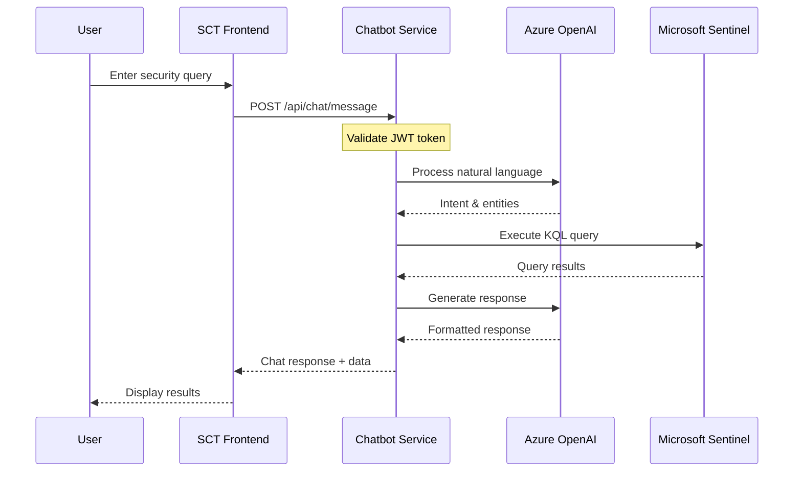
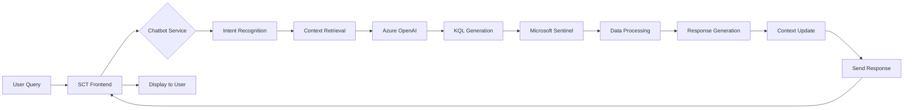

# Chatbot Microservice Integration Guide

## Overview

This document describes the integration between the Security Control Tower (SCT) and the separate Chatbot microservice. The Chatbot microservice provides advanced conversational AI capabilities for security analysis and extends the existing SentriBot functionality to support multi-channel communication, conversation context management, and enhanced natural language understanding.

---

## Table of Contents

1. [Architecture Overview](#architecture-overview)
2. [Integration Points](#integration-points)
3. [API Specifications](#api-specifications)
4. [Authentication & Authorization](#authentication--authorization)
5. [Data Flow](#data-flow)
6. [Deployment Architecture](#deployment-architecture)
7. [Configuration](#configuration)
8. [Error Handling](#error-handling)
9. [Monitoring & Observability](#monitoring--observability)
10. [Development Workflow](#development-workflow)
11. [Testing Strategy](#testing-strategy)

---

## Architecture Overview

### System Context

The Chatbot microservice operates as an independent service that:
- Provides conversational AI capabilities through RESTful and WebSocket APIs
- Manages conversation context and history
- Integrates with Azure OpenAI for natural language processing
- Accesses Microsoft Sentinel data through the same service principal as SCT
- Supports multiple communication channels (Web, Teams, Slack, etc.)

### Component Interaction



### Repository Structure

The Chatbot microservice will be maintained in a **separate repository** with the following structure:

```
sct-chatbot-service/
├── .github/
│   └── workflows/
│       ├── ci.yml                    # Continuous Integration
│       ├── cd-staging.yml            # Deploy to staging
│       └── cd-production.yml         # Deploy to production
├── app/
│   ├── api/
│   │   ├── v1/
│   │   │   ├── endpoints/
│   │   │   │   ├── chat.py          # Chat endpoints
│   │   │   │   ├── conversations.py # Conversation management
│   │   │   │   └── health.py        # Health checks
│   │   │   └── router.py            # API router
│   │   └── deps.py                  # Dependencies
│   ├── core/
│   │   ├── config.py                # Configuration management
│   │   ├── security.py              # JWT validation
│   │   └── logging.py               # Logging configuration
│   ├── models/
│   │   ├── chat.py                  # Chat data models
│   │   └── user.py                  # User models
│   ├── services/
│   │   ├── conversation_manager.py  # Conversation logic
│   │   ├── intent_recognizer.py     # Intent detection
│   │   ├── openai_service.py        # Azure OpenAI integration
│   │   ├── sentinel_service.py      # Sentinel queries
│   │   └── context_store.py         # Context management
│   ├── adapters/
│   │   ├── web_adapter.py           # Web channel
│   │   ├── teams_adapter.py         # MS Teams channel
│   │   └── slack_adapter.py         # Slack channel
│   └── main.py                       # FastAPI application
├── tests/
│   ├── unit/                         # Unit tests
│   ├── integration/                  # Integration tests
│   └── e2e/                          # End-to-end tests
├── docker/
│   ├── Dockerfile                    # Container image
│   └── docker-compose.yml            # Local development
├── infrastructure/
│   ├── terraform/                    # Infrastructure as Code
│   └── kubernetes/                   # K8s manifests
├── docs/
│   ├── API.md                        # API documentation
│   ├── SETUP.md                      # Setup guide
│   └── CONTRIBUTING.md               # Contribution guidelines
├── .env.example                      # Environment variables template
├── requirements.txt                  # Python dependencies
├── pyproject.toml                    # Project configuration
├── README.md                         # Project README
└── LICENSE                           # License file
```

---

## Integration Points

### 1. SCT Frontend Integration

The SCT Angular frontend will integrate with the Chatbot service through:

**HTTP Client Service** (`ChatbotService`):
```typescript
// SCT-UI/src/app/services/chatbot.service.ts
import { Injectable } from '@angular/core';
import { HttpClient, HttpHeaders } from '@angular/common/http';
import { Observable } from 'rxjs';
import { AuthService } from './auth.service';

interface ChatMessage {
  message: string;
  conversationId?: string;
  context?: any;
}

interface ChatResponse {
  response: string;
  conversationId: string;
  data?: any;
  suggestions?: string[];
}

@Injectable({
  providedIn: 'root'
})
export class ChatbotService {
  private apiUrl = environment.chatbotApiUrl; // e.g., 'https://chatbot.sct.azure.com/api/v1'

  constructor(
    private http: HttpClient,
    private authService: AuthService
  ) {}

  async sendMessage(message: ChatMessage): Promise<ChatResponse> {
    const token = await this.authService.getAccessToken();
    const headers = new HttpHeaders({
      'Authorization': `Bearer ${token}`,
      'Content-Type': 'application/json'
    });

    return this.http.post<ChatResponse>(
      `${this.apiUrl}/chat/message`,
      message,
      { headers }
    ).toPromise();
  }

  async getConversationHistory(userId: string): Promise<any[]> {
    const token = await this.authService.getAccessToken();
    const headers = new HttpHeaders({
      'Authorization': `Bearer ${token}`
    });

    return this.http.get<any[]>(
      `${this.apiUrl}/chat/conversations/${userId}`,
      { headers }
    ).toPromise();
  }
}
```

**WebSocket Connection** (for real-time chat):
```typescript
// SCT-UI/src/app/services/chatbot-websocket.service.ts
import { Injectable } from '@angular/core';
import { webSocket, WebSocketSubject } from 'rxjs/webSocket';

@Injectable({
  providedIn: 'root'
})
export class ChatbotWebSocketService {
  private socket$: WebSocketSubject<any>;
  private wsUrl = environment.chatbotWsUrl; // 'wss://chatbot.sct.azure.com/ws/chat'

  connect(userId: string, token: string): WebSocketSubject<any> {
    this.socket$ = webSocket({
      url: `${this.wsUrl}/${userId}?token=${token}`,
      openObserver: {
        next: () => console.log('WebSocket connected')
      },
      closeObserver: {
        next: () => console.log('WebSocket disconnected')
      }
    });
    return this.socket$;
  }

  sendMessage(message: any): void {
    this.socket$.next(message);
  }

  disconnect(): void {
    if (this.socket$) {
      this.socket$.complete();
    }
  }
}
```

### 2. Shared Service Integration

Both SCT and Chatbot service access Microsoft Sentinel using the same service principal:

**Azure AD App Registration**:
- Same App Registration for both services
- Shared API permissions: `https://api.loganalytics.io/.default`
- Service Principal credentials stored in Azure Key Vault

**Configuration** (both services):
```json
{
  "azure": {
    "tenantId": "your-tenant-id",
    "clientId": "shared-client-id",
    "clientSecret": "from-keyvault",
    "workspaceId": "sentinel-workspace-id"
  }
}
```

### 3. Azure OpenAI Integration

The Chatbot service uses Azure OpenAI for:
- Natural language understanding
- Intent and entity extraction
- Response generation
- Query refinement

**Shared OpenAI Instance**: Both SCT frontend and Chatbot service can use the same Azure OpenAI instance, but the Chatbot service handles more complex conversation management.

---

## API Specifications

### Base URL
- **Production**: `https://chatbot.sct.azure.com/api/v1`
- **Staging**: `https://chatbot-staging.sct.azure.com/api/v1`
- **Development**: `http://localhost:8000/api/v1`

### Authentication
All API requests require a valid JWT token in the Authorization header:
```
Authorization: Bearer <jwt-token>
```

### Endpoints

#### 1. Send Chat Message

**Endpoint**: `POST /api/v1/chat/message`

**Request**:
```json
{
  "message": "Show me all high-severity incidents from the last 24 hours",
  "conversationId": "optional-conversation-id",
  "userId": "user@example.com",
  "context": {
    "currentView": "dashboard",
    "filters": {}
  }
}
```

**Response** (200 OK):
```json
{
  "conversationId": "conv-123-456-789",
  "messageId": "msg-987-654-321",
  "response": {
    "text": "I found 15 high-severity incidents in the last 24 hours. Here's the breakdown:",
    "type": "text_with_data"
  },
  "data": {
    "incidents": [
      {
        "incidentId": "INC-001",
        "severity": "High",
        "title": "Suspicious login attempt",
        "timestamp": "2024-12-09T10:30:00Z"
      }
    ],
    "summary": {
      "total": 15,
      "critical": 2,
      "high": 13
    }
  },
  "suggestions": [
    "Show details for incident INC-001",
    "Filter by incident source",
    "Show incidents by user"
  ],
  "timestamp": "2024-12-09T12:45:00Z"
}
```

**Error Response** (400 Bad Request):
```json
{
  "error": {
    "code": "INVALID_MESSAGE",
    "message": "Message cannot be empty",
    "details": {}
  }
}
```

#### 2. Get Conversation History

**Endpoint**: `GET /api/v1/chat/conversations/{userId}`

**Query Parameters**:
- `limit` (optional): Number of conversations to return (default: 10)
- `offset` (optional): Pagination offset (default: 0)

**Response** (200 OK):
```json
{
  "conversations": [
    {
      "conversationId": "conv-123-456-789",
      "userId": "user@example.com",
      "startedAt": "2024-12-09T10:00:00Z",
      "lastMessageAt": "2024-12-09T12:45:00Z",
      "messageCount": 8,
      "summary": "Discussion about high-severity incidents",
      "messages": [
        {
          "messageId": "msg-001",
          "role": "user",
          "content": "Show me all high-severity incidents",
          "timestamp": "2024-12-09T10:00:00Z"
        },
        {
          "messageId": "msg-002",
          "role": "assistant",
          "content": "I found 15 high-severity incidents...",
          "timestamp": "2024-12-09T10:00:15Z"
        }
      ]
    }
  ],
  "total": 45,
  "limit": 10,
  "offset": 0
}
```

#### 3. Clear Conversation Context

**Endpoint**: `POST /api/v1/chat/conversations/{conversationId}/clear`

**Response** (200 OK):
```json
{
  "message": "Conversation context cleared successfully",
  "conversationId": "conv-123-456-789"
}
```

#### 4. Health Check

**Endpoint**: `GET /api/v1/health`

**Response** (200 OK):
```json
{
  "status": "healthy",
  "version": "1.0.0",
  "timestamp": "2024-12-09T12:45:00Z",
  "dependencies": {
    "azure_openai": "connected",
    "microsoft_sentinel": "connected",
    "redis": "connected"
  }
}
```

### WebSocket API

#### Connection

**Endpoint**: `WS /ws/chat/{userId}?token={jwt-token}`

**Message Format** (Client -> Server):
```json
{
  "type": "message",
  "conversationId": "conv-123-456-789",
  "content": "Show me recent security alerts"
}
```

**Message Format** (Server -> Client):
```json
{
  "type": "response",
  "conversationId": "conv-123-456-789",
  "messageId": "msg-987-654-321",
  "content": {
    "text": "Here are the recent security alerts...",
    "data": {}
  },
  "timestamp": "2024-12-09T12:45:00Z"
}
```

---

## Authentication & Authorization

### JWT Token Validation

The Chatbot service validates JWT tokens issued by Azure AD:

**Token Requirements**:
- Issuer: `https://login.microsoftonline.com/{tenant-id}/v2.0`
- Audience: `api://chatbot-service` (or shared app client ID)
- Required claims: `oid` (user ID), `preferred_username`, `roles`

**Python Implementation** (chatbot service):
```python
from fastapi import Depends, HTTPException, status
from fastapi.security import HTTPBearer, HTTPAuthCredentials
from jose import jwt, JWTError

security = HTTPBearer()

async def validate_token(credentials: HTTPAuthCredentials = Depends(security)):
    token = credentials.credentials
    try:
        payload = jwt.decode(
            token,
            key=AZURE_AD_PUBLIC_KEY,
            algorithms=["RS256"],
            audience=AZURE_AD_AUDIENCE,
            issuer=AZURE_AD_ISSUER
        )
        return payload
    except JWTError:
        raise HTTPException(
            status_code=status.HTTP_401_UNAUTHORIZED,
            detail="Invalid authentication token"
        )
```

### Role-Based Access Control

**Supported Roles**:
- `SecurityAnalyst`: Can query data and use chatbot
- `SecurityManager`: All analyst permissions + conversation history access
- `Administrator`: All permissions + service configuration

---

## Data Flow

### Query Processing Flow



### Conversation Context Management

The Chatbot service maintains conversation context to enable:
- Multi-turn conversations
- Follow-up questions
- Context-aware responses
- Personalized interactions

**Context Storage**:
- **Short-term**: Redis cache (TTL: 1 hour)
- **Long-term**: Cosmos DB (for conversation history)

---

## Deployment Architecture

### Azure Infrastructure

```
┌─────────────────────────────────────────────────────────────┐
│                    Azure Subscription                        │
│                                                              │
│  ┌────────────────────────────────────────────────────────┐ │
│  │         Resource Group: rg-sct-production              │ │
│  │                                                         │ │
│  │  ┌──────────────────┐    ┌──────────────────┐        │ │
│  │  │   Azure Web App  │    │  Chatbot Service │        │ │
│  │  │   (SCT Frontend) │    │   (AKS/ACI)      │        │ │
│  │  └──────────────────┘    └──────────────────┘        │ │
│  │           │                       │                   │ │
│  │           └───────────┬───────────┘                   │ │
│  │                       │                               │ │
│  │         ┌─────────────┴─────────────┐                │ │
│  │         │                           │                │ │
│  │    ┌────▼────────┐         ┌───────▼──────┐        │ │
│  │    │   Azure AD  │         │  Azure OpenAI │        │ │
│  │    │             │         │    Service    │        │ │
│  │    └────┬────────┘         └───────┬──────┘        │ │
│  │         │                           │                │ │
│  │    ┌────▼────────────────────────────▼──────┐      │ │
│  │    │      Microsoft Sentinel                 │      │ │
│  │    │      (Log Analytics Workspace)          │      │ │
│  │    └─────────────────────────────────────────┘      │ │
│  │                                                      │ │
│  │    ┌───────────────┐         ┌───────────────┐     │ │
│  │    │  Redis Cache  │         │   Cosmos DB   │     │ │
│  │    │  (Context)    │         │   (History)   │     │ │
│  │    └───────────────┘         └───────────────┘     │ │
│  │                                                      │ │
│  └──────────────────────────────────────────────────────┘ │
└─────────────────────────────────────────────────────────────┘
```

### Container Deployment

**Dockerfile** (Chatbot service):
```dockerfile
FROM python:3.11-slim

WORKDIR /app

COPY requirements.txt .
RUN pip install --no-cache-dir -r requirements.txt

COPY app/ ./app/

EXPOSE 8000

CMD ["uvicorn", "app.main:app", "--host", "0.0.0.0", "--port", "8000"]
```

### Deployment Options

1. **Azure Kubernetes Service (AKS)** - Recommended for production
   - Horizontal auto-scaling
   - High availability
   - Service mesh capabilities

2. **Azure Container Instances (ACI)** - Good for development/staging
   - Simpler deployment
   - Lower cost for low-traffic scenarios
   - Quick startup

3. **Azure Web Apps for Containers** - Alternative option
   - Managed platform
   - Built-in SSL/custom domains
   - Easy integration with Azure services

---

## Configuration

### Environment Variables

**Required for Chatbot Service**:

```bash
# Azure AD Configuration
AZURE_TENANT_ID=your-tenant-id
AZURE_CLIENT_ID=your-client-id
AZURE_CLIENT_SECRET=from-keyvault

# Azure OpenAI Configuration
AZURE_OPENAI_ENDPOINT=https://your-openai.openai.azure.com/
AZURE_OPENAI_API_KEY=from-keyvault
AZURE_OPENAI_DEPLOYMENT=gpt-4o

# Microsoft Sentinel Configuration
AZURE_WORKSPACE_ID=your-workspace-id

# Redis Configuration (Context Store)
REDIS_HOST=your-redis.redis.cache.windows.net
REDIS_PORT=6380
REDIS_PASSWORD=from-keyvault
REDIS_SSL=true

# Cosmos DB Configuration (History Store)
COSMOS_DB_ENDPOINT=https://your-cosmos.documents.azure.com:443/
COSMOS_DB_KEY=from-keyvault
COSMOS_DB_DATABASE=chatbot
COSMOS_DB_CONTAINER=conversations

# Application Configuration
APP_NAME=sct-chatbot-service
APP_VERSION=1.0.0
LOG_LEVEL=INFO
ENVIRONMENT=production
```

### SCT Frontend Configuration

**Add to SCT-UI environment files**:

```typescript
// SCT-UI/src/environments/environment.prod.ts
export const environment = {
  production: true,
  // Existing configuration...
  chatbotApiUrl: 'https://chatbot.sct.azure.com/api/v1',
  chatbotWsUrl: 'wss://chatbot.sct.azure.com/ws/chat',
  chatbotEnabled: true
};
```

---

## Error Handling

### Error Response Format

All errors follow a consistent format:

```json
{
  "error": {
    "code": "ERROR_CODE",
    "message": "Human-readable error message",
    "details": {
      "field": "Additional context"
    },
    "timestamp": "2024-12-09T12:45:00Z",
    "requestId": "req-123-456-789"
  }
}
```

### Common Error Codes

| Code | Status | Description |
|------|--------|-------------|
| `INVALID_TOKEN` | 401 | JWT token is invalid or expired |
| `INSUFFICIENT_PERMISSIONS` | 403 | User lacks required permissions |
| `INVALID_MESSAGE` | 400 | Message format is invalid |
| `CONVERSATION_NOT_FOUND` | 404 | Conversation ID doesn't exist |
| `RATE_LIMIT_EXCEEDED` | 429 | Too many requests |
| `OPENAI_SERVICE_ERROR` | 502 | Azure OpenAI service unavailable |
| `SENTINEL_QUERY_ERROR` | 502 | Microsoft Sentinel query failed |
| `INTERNAL_SERVER_ERROR` | 500 | Unexpected server error |

### Retry Strategy

**Client-side retry logic** (SCT frontend):
```typescript
async sendMessageWithRetry(message: ChatMessage, maxRetries = 3): Promise<ChatResponse> {
  for (let attempt = 1; attempt <= maxRetries; attempt++) {
    try {
      return await this.sendMessage(message);
    } catch (error) {
      if (attempt === maxRetries || error.status === 400 || error.status === 401) {
        throw error;
      }
      const delay = Math.min(1000 * Math.pow(2, attempt), 10000);
      await this.delay(delay);
    }
  }
}
```

---

## Monitoring & Observability

### Metrics

**Key Performance Indicators**:
- Request latency (p50, p95, p99)
- Request rate (requests per second)
- Error rate
- Conversation duration
- Active conversations
- OpenAI API call duration
- Sentinel query duration

### Logging

**Structured logging format**:
```json
{
  "timestamp": "2024-12-09T12:45:00Z",
  "level": "INFO",
  "service": "chatbot-service",
  "version": "1.0.0",
  "traceId": "trace-123-456",
  "userId": "user@example.com",
  "conversationId": "conv-123-456-789",
  "event": "message_processed",
  "duration_ms": 1250,
  "metadata": {
    "intent": "query_incidents",
    "sentiment_query_executed": true
  }
}
```

### Health Checks

**Kubernetes liveness probe**:
```yaml
livenessProbe:
  httpGet:
    path: /api/v1/health
    port: 8000
  initialDelaySeconds: 30
  periodSeconds: 10
```

**Kubernetes readiness probe**:
```yaml
readinessProbe:
  httpGet:
    path: /api/v1/health/ready
    port: 8000
  initialDelaySeconds: 10
  periodSeconds: 5
```

### Application Insights Integration

Both SCT and Chatbot service should log to the same Application Insights instance for unified telemetry.

---

## Development Workflow

### Local Development Setup

1. **Clone repositories**:
```bash
# Clone SCT repository
git clone https://github.com/VaishanviM23/SCT.git

# Clone Chatbot service repository (when created)
git clone https://github.com/VaishanviM23/sct-chatbot-service.git
```

2. **Start Chatbot service locally**:
```bash
cd sct-chatbot-service
python -m venv venv
source venv/bin/activate  # On Windows: venv\Scripts\activate
pip install -r requirements.txt
cp .env.example .env
# Edit .env with your configuration
uvicorn app.main:app --reload --port 8000
```

3. **Configure SCT frontend to use local Chatbot service**:
```typescript
// SCT-UI/src/environments/environment.ts
export const environment = {
  production: false,
  chatbotApiUrl: 'http://localhost:8000/api/v1',
  chatbotWsUrl: 'ws://localhost:8000/ws/chat',
  chatbotEnabled: true
};
```

4. **Start SCT frontend**:
```bash
cd SCT/SCT-UI
npm install
ng serve
```

### Testing Integration

**Integration test example** (SCT frontend):
```typescript
// SCT-UI/src/app/services/chatbot.service.spec.ts
describe('ChatbotService Integration', () => {
  let service: ChatbotService;
  let httpMock: HttpTestingController;

  beforeEach(() => {
    TestBed.configureTestingModule({
      imports: [HttpClientTestingModule],
      providers: [ChatbotService, AuthService]
    });
    service = TestBed.inject(ChatbotService);
    httpMock = TestBed.inject(HttpTestingController);
  });

  it('should send message to chatbot service', async () => {
    const mockResponse: ChatResponse = {
      response: 'Test response',
      conversationId: 'conv-123',
      data: {}
    };

    const promise = service.sendMessage({
      message: 'Test query'
    });

    const req = httpMock.expectOne(`${environment.chatbotApiUrl}/chat/message`);
    expect(req.request.method).toBe('POST');
    expect(req.request.headers.get('Authorization')).toContain('Bearer');
    req.flush(mockResponse);

    const result = await promise;
    expect(result).toEqual(mockResponse);
  });
});
```

---

## Testing Strategy

### Unit Tests
- Test individual components, services, and utilities
- Mock external dependencies (Azure OpenAI, Sentinel)
- Target: >80% code coverage

### Integration Tests
- Test API endpoints with real database connections (test environment)
- Test authentication/authorization flows
- Test conversation context management

### End-to-End Tests
- Test complete user workflows from SCT frontend to Chatbot service
- Test WebSocket communication
- Test error handling and recovery

### Performance Tests
- Load testing with k6 or Locust
- Concurrent conversation handling
- Response time under load

---

## Security Considerations

### Data Privacy
- All conversation data encrypted in transit (TLS 1.3)
- Conversation history encrypted at rest
- PII handling compliance (GDPR, CCPA)

### Access Control
- JWT token validation on every request
- Role-based authorization
- Rate limiting per user/IP

### Secrets Management
- All secrets stored in Azure Key Vault
- No secrets in source code or environment files
- Automatic secret rotation

---

## Migration Path

### Phase 1: Documentation & Setup (Current)
- ✅ Create Chatbot microservice documentation
- ✅ Define API specifications
- ✅ Set up repository structure template

### Phase 2: Parallel Development
- Develop Chatbot service independently
- Maintain existing SentriBot functionality in SCT frontend
- Both services operational simultaneously

### Phase 3: Integration
- Integrate SCT frontend with Chatbot service
- Implement feature flags for gradual rollout
- Run A/B tests comparing old vs new implementation

### Phase 4: Migration
- Gradually shift traffic to Chatbot service
- Monitor performance and user feedback
- Deprecate direct Azure OpenAI calls from frontend

### Phase 5: Cleanup
- Remove legacy SentriBot logic from frontend
- Chatbot service becomes primary conversation interface
- Document lessons learned

---

## References

- [ADR-004: Chatbot Microservice Architecture](./adr/ADR-004-Chatbot-Microservice.md)
- [Chatbot Repository README Template](./templates/chatbot-service/README.md)
- [API Documentation](./templates/chatbot-service/API.md)
- [FastAPI Documentation](https://fastapi.tiangolo.com/)
- [Azure OpenAI Service](https://docs.microsoft.com/azure/cognitive-services/openai/)

---

**Document Version**: 1.0  
**Last Updated**: 2024-12-09  
**Maintained By**: SCT Development Team
