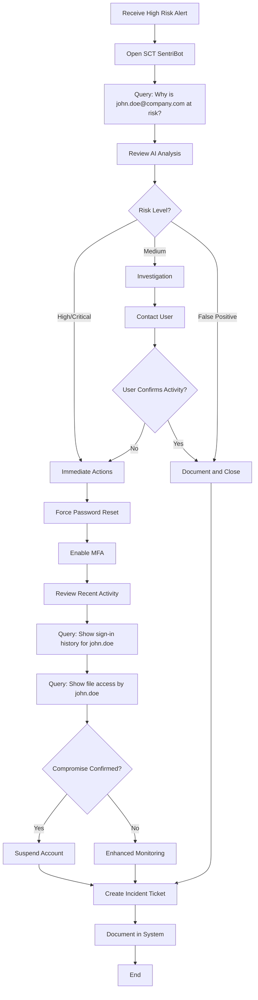
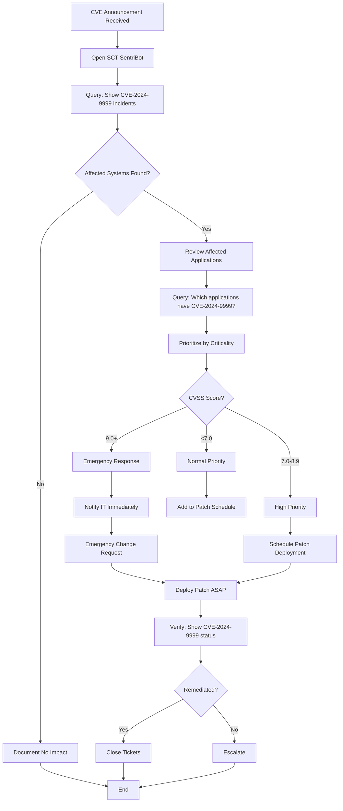

# Functional Documentation - Security Control Tower (SCT)

## Overview

The Security Control Tower (SCT) is an AI-powered security monitoring platform that enables security teams to efficiently monitor, analyze, and respond to security threats. This document provides functional documentation suitable for both technical and non-technical stakeholders.

---

## Table of Contents

1. [User Roles and Personas](#user-roles-and-personas)
2. [Core Features](#core-features)
3. [Business Processes](#business-processes)
4. [Feature Details](#feature-details)
5. [User Workflows](#user-workflows)
6. [Integration Overview](#integration-overview)
7. [Key Business Logic](#key-business-logic)

---

## User Roles and Personas

### Security Operations Center (SOC) Analyst
**Primary User**: Maria, SOC Analyst

**Responsibilities**:
- Monitor security alerts and incidents in real-time
- Investigate potential security threats
- Query security data for incident response
- Track vulnerability status across applications
- Generate reports for management

**Key Tasks in SCT**:
- Use SentriBot to query security data using natural language
- Review security incidents from multiple sources (Qualys, Microsoft XDR)
- Analyze user risk events and suspicious activities
- Monitor security dashboards for trending threats
- Track CVE vulnerabilities across the organization

**Example Questions Maria Asks**:
- "Show me all high-severity incidents from the last 24 hours"
- "Find users who are at risk and explain why"
- "Which applications have the most CVE vulnerabilities?"
- "Show me failed login attempts from unusual locations"

---

### Security Manager
**Primary User**: Robert, Security Manager

**Responsibilities**:
- Oversee security operations team
- Track security metrics and KPIs
- Report security posture to executives
- Ensure compliance with security policies
- Manage security budget and resources

**Key Tasks in SCT**:
- Review security posture overview
- Monitor Microsoft Secure Score trends
- Track Mean Time to Remediate (MTTR) metrics
- Review AI-generated security insights
- Monitor integration health with security tools

**Key Metrics Robert Tracks**:
- Overall security score percentage
- Number of critical incidents open
- Average time to resolve incidents
- Compliance status across categories
- System integration health

---

### Incident Response Team Member
**Primary User**: Jennifer, Incident Responder

**Responsibilities**:
- Respond to security incidents quickly
- Investigate root causes of security events
- Coordinate remediation activities
- Document incident response procedures
- Conduct post-incident analysis

**Key Tasks in SCT**:
- Quickly query specific incidents and alerts
- Correlate events across multiple security sources
- Analyze user behavior and sign-in patterns
- Track incident timeline and related events
- Generate incident reports with AI assistance

**Example Scenarios**:
- User account shows suspicious activity → Query user risk events and sign-in logs
- CVE announced for critical software → Search for affected applications
- Ransomware alert triggered → Investigate related file and process events
- Data exfiltration suspected → Analyze network traffic and user access patterns

---

## Core Features

### 1. SentriBot - AI-Powered Security Assistant

**Business Purpose**: Enable security analysts to query complex security data using natural language instead of writing code.

**Key Capabilities**:
- **Natural Language Queries**: Ask questions in plain English
- **Automatic Query Generation**: AI converts questions to KQL queries
- **Multi-Source Data Access**: Query data from Qualys, Microsoft XDR, Azure AD, and more
- **Intelligent Analysis**: AI provides context, insights, and recommendations
- **CVE Tracking**: Track vulnerabilities across all applications
- **User Risk Analysis**: Identify high-risk users with explanations

**Business Value**:
- **Reduced Query Time**: 10 minutes → 30 seconds per query
- **Lower Training Requirements**: Less KQL knowledge needed
- **Faster Threat Detection**: Quick access to relevant security data
- **Better Decision Making**: AI provides context and recommendations

**Example Interactions**:

**Query 1: User Risk Analysis**
```
User Input: "Find the top three users that are at risk and explain why"

SentriBot Response:
📊 TOP 3 AT-RISK USERS ANALYSIS

Based on the last 30 days of security events:

🔍 IDENTIFIED USERS:

1. john.doe@company.com (HIGH RISK)
   • Risk Score: 15 events
   • Risk Types: maliciousIPAddress, leakedCredentials
   • Latest Activity: 2 hours ago
   
   ⚠️ RISK ASSESSMENT:
   This user's credentials appear in a leaked credential database and recent 
   sign-ins originated from known malicious IP addresses. There is a HIGH 
   likelihood of account compromise.
   
   💡 IMMEDIATE ACTIONS:
   • Force password reset immediately
   • Enable mandatory MFA if not already active
   • Review recent file and email access
   • Consider temporary account suspension

2. jane.smith@company.com (MEDIUM RISK)
   • Risk Score: 8 events
   • Risk Types: unfamiliarFeatures, suspiciousIPAddress
   • Latest Activity: 6 hours ago
   
   ⚠️ RISK ASSESSMENT:
   Sign-ins detected from unfamiliar locations with unusual characteristics.
   Possible credential sharing or account access from compromised device.
   
   💡 RECOMMENDED ACTIONS:
   • Contact user to verify recent sign-in locations
   • Review conditional access policies
   • Enable risk-based sign-in policies

3. bob.jones@company.com (MEDIUM RISK)
   • Risk Score: 5 events
   • Risk Types: anonymizedIPAddress (Tor/VPN usage)
   • Latest Activity: 1 day ago
   
   ⚠️ RISK ASSESSMENT:
   User accessing corporate resources through anonymized networks (Tor/VPN).
   May indicate privacy concerns or potential policy violation.
   
   💡 RECOMMENDED ACTIONS:
   • Verify if VPN usage is approved
   • Apply conditional access policy for anonymized IPs
   • Review acceptable use policy with user
```

**Query 2: CVE Vulnerability Tracking**
```
User Input: "Show me all CVEs affecting the hr-portal application"

SentriBot Response:
📊 CVE VULNERABILITIES - HR-PORTAL APPLICATION

Found 3 CVEs affecting hr-portal in the last 30 days:

🔴 CRITICAL SEVERITY:
1. CVE-2024-1234 (CVSS 9.8)
   • Detected: 2 days ago
   • Source: Qualys Vulnerability Scan
   • Description: Remote Code Execution in authentication module
   • Status: OPEN - Patch pending deployment
   • Affected Instances: 5 servers
   
   💡 RECOMMENDATION: Deploy patch within 24 hours. CVE is actively 
   exploited in the wild according to threat intelligence.

🟠 HIGH SEVERITY:
2. CVE-2024-5678 (CVSS 8.2)
   • Detected: 5 days ago
   • Source: Microsoft Defender XDR
   • Description: SQL Injection vulnerability in report module
   • Status: IN PROGRESS - Patch scheduled for deployment
   • Affected Instances: 3 servers
   
3. CVE-2024-9012 (CVSS 7.5)
   • Detected: 10 days ago
   • Source: Qualys
   • Description: Cross-Site Scripting (XSS) in user profile
   • Status: REMEDIATED
   • Patched On: Yesterday
   
📋 SUMMARY:
• Total CVEs: 3
• Critical: 1 (requires immediate action)
• High: 1 (in progress)
• Remediated: 1
• Overall Risk: HIGH due to active critical CVE
```

---

### 2. Security Posture Overview

**Business Purpose**: Provide executive-level visibility into overall security health and trends.

**Key Components**:

#### A. Microsoft Secure Score
Measures security posture across five categories:

**What It Measures**:
- **Identity** (82.56%): User authentication security, MFA adoption, conditional access
- **Data** (55.41%): Data classification, encryption, loss prevention
- **Device** (49.04%): Endpoint protection, compliance, patch status
- **Apps** (83.73%): Application security, OAuth permissions, third-party apps
- **Cloud** (43.0%): Cloud resource configuration, network security, storage encryption

**Business Interpretation**:
- **Above 70%**: Good security posture, maintain current controls
- **50-70%**: Moderate risk, prioritize improvements
- **Below 50%**: High risk, immediate action required

**Example**: If Data score is 55.41%, it means:
- 155 out of 280 available security points achieved
- Actions needed: Implement data classification, enable encryption at rest

#### B. AI-Powered Security Insights

**What It Does**: Machine learning analyzes security data to predict and detect threats.

**Insight Categories**:

1. **Threat Detection** (Priority: High/Critical)
   - Unusual login patterns
   - Suspicious authentication attempts
   - Potential account compromises
   
   **Example**: "AI detected 15% increase in failed login attempts from Eastern Europe 
   IPs in last 24h. Confidence: 94%. Recommendation: Enable conditional access 
   policies for high-risk regions."

2. **Vulnerability Assessment** (Priority: Critical)
   - Critical vulnerabilities requiring patching
   - Attack surface analysis
   - Exposure risk calculation
   
   **Example**: "ML analysis identifies 3 servers with CVE-2024-1234 requiring 
   immediate patching. Confidence: 98%. Recommendation: Deploy patches within 
   24 hours to prevent potential exploitation."

3. **Behavioral Analytics** (Priority: Medium)
   - Anomalous user behavior
   - Data access pattern changes
   - Insider threat indicators
   
   **Example**: "AI baseline analysis shows 200% increase in SharePoint access by 
   john.doe@company.com. Confidence: 87%. Recommendation: Review user access 
   permissions and implement data loss prevention policies."

4. **Predictive Security** (Priority: Low/Medium)
   - Predicted attack vectors
   - Threat trend analysis
   - Emerging vulnerability patterns
   
   **Example**: "AI model predicts 73% likelihood of targeted phishing campaign 
   based on threat intelligence. Confidence: 73%. Recommendation: Increase 
   security awareness training and enable advanced threat protection."

#### C. Performance Metrics

**Mean Time to Remediate (MTTR)**:
- **What It Measures**: Average days from incident detection to resolution
- **Current: 92.07 days** (organization average)
- **Critical Incidents: 80.74 days** (target: < 7 days)
- **High Priority: 91.94 days** (target: < 30 days)

**Business Impact**:
- Lower MTTR = Less exposure window for attackers
- Faster remediation = Reduced business risk
- Trending down = Improving security operations

**Incidents Past SLA**: 26.20%
- Indicates percentage of incidents not resolved within target timeframe
- High percentage suggests need for more resources or better processes
- Target: < 10%

#### D. Connected Systems Health

**Purpose**: Monitor integration health with external security tools.

**Connected Systems Status**:

| System | Status | Last Sync | Data Volume | Business Function |
|--------|--------|-----------|-------------|-------------------|
| Rapid7 | ✅ Connected | 5 min ago | 2.4 MB/day | Vulnerability scanning |
| CrowdStrike | ✅ Connected | 2 min ago | 5.7 MB/day | Endpoint protection |
| Qualys | ⚠️ Warning | 1 hr ago | 1.8 MB/day | Infrastructure vulnerability scans |
| ServiceNow | ✅ Connected | 15 min ago | 3.2 MB/day | Incident ticketing |
| Tenable | ❌ Error | 2 hr ago | 0.8 MB/day | Network vulnerability assessment |

**Health Indicators**:
- **✅ Connected**: System healthy, data flowing normally
- **⚠️ Warning**: Delayed sync, may need attention
- **❌ Error**: Integration failed, immediate action required

**Business Impact**:
- Integration failures = Missing security data
- Delayed syncs = Stale information for decisions
- Monitoring ensures complete visibility

---

### 3. Security Dashboards (Power BI Integration)

**Business Purpose**: Provide interactive visualizations for different security domains.

**Available Dashboards**:

#### A. Threat & Incident Report
**Purpose**: Track security incidents and threats across the organization.

**Key Metrics**:
- Total incidents by severity (Critical, High, Medium, Low)
- Incident trends over time
- Top affected systems and applications
- Incident resolution status
- Mean Time to Detect (MTTD) and MTTR

**Use Cases**:
- Daily incident review meetings
- Trend analysis for security improvements
- Executive reporting
- Capacity planning

#### B. Identity & Access Management
**Purpose**: Monitor user authentication and access patterns.

**Key Metrics**:
- Sign-in success/failure rates
- Geographic distribution of sign-ins
- MFA adoption and usage
- Conditional access policy effectiveness
- Risky sign-in events

**Use Cases**:
- Identify compromised accounts
- Monitor authentication policy effectiveness
- Track MFA rollout progress
- Detect unauthorized access attempts

#### C. Asset & Endpoint Security
**Purpose**: Track device security and compliance status.

**Key Metrics**:
- Device compliance percentage
- Patch deployment status
- Antivirus/EDR coverage
- Vulnerable devices
- OS version distribution

**Use Cases**:
- Patch management prioritization
- Compliance reporting
- Endpoint protection coverage
- Device health monitoring

#### D. Cloud Workload Security
**Purpose**: Monitor cloud infrastructure and workload security.

**Key Metrics**:
- Cloud security configuration compliance
- Resource exposure (public IPs, open ports)
- Cloud service usage and security
- Storage encryption status
- Network security group effectiveness

**Use Cases**:
- Cloud security posture management
- Misconfiguration detection
- Cloud resource inventory
- Security best practices compliance

#### E. Compliance & Governance
**Purpose**: Track regulatory compliance and policy adherence.

**Key Metrics**:
- Compliance score by framework (NIST, ISO, PCI-DSS, etc.)
- Policy violations and exceptions
- Audit log analysis
- Privileged access usage
- Data classification coverage

**Use Cases**:
- Regulatory audit preparation
- Policy effectiveness measurement
- Compliance gap analysis
- Risk assessment reporting

---

## Business Processes

### Process 1: Daily Security Monitoring

**Objective**: Ensure continuous security monitoring and rapid threat detection.

**Frequency**: Daily, multiple times per day

**Steps**:

1. **Morning Security Review** (8:00 AM - 9:00 AM)
   - SOC Analyst logs into SCT
   - Reviews Overview page for overnight alerts
   - Checks AI Insights for new critical/high priority items
   - Reviews Security Score changes
   - Checks Connected Systems health

2. **Incident Triage** (Throughout Day)
   - Reviews new incidents in Threat & Incident dashboard
   - Uses SentriBot to query specific incident details
   - Prioritizes incidents based on severity and business impact
   - Assigns incidents to team members

3. **User Risk Monitoring** (11:00 AM, 3:00 PM)
   - Queries SentriBot: "Show me users at risk in the last 4 hours"
   - Reviews high-risk user activities
   - Investigates anomalous behaviors
   - Takes action (password reset, MFA enforcement, etc.)

4. **End-of-Day Review** (5:00 PM - 6:00 PM)
   - Reviews unresolved incidents
   - Updates incident status in ServiceNow
   - Prepares handoff notes for night shift
   - Checks metric trends

**Tools Used**: SentriBot, Overview page, Threat & Incident dashboard

**Success Metrics**:
- All critical incidents triaged within 15 minutes
- High-risk users investigated within 4 hours
- No security events missed

---

### Process 2: CVE Vulnerability Management

**Objective**: Track and remediate CVE vulnerabilities across all applications.

**Frequency**: Weekly review, immediate action for critical CVEs

**Steps**:

1. **Weekly Vulnerability Scan Review** (Every Monday)
   - Security Manager reviews new CVEs from Qualys and XDR
   - Uses SentriBot: "Show me all new CVEs from last week"
   - Prioritizes based on CVSS score and exploitability
   - Assigns remediation owners

2. **Application-Specific CVE Analysis**
   - For each critical CVE:
     - Query: "Show me CVE-XXXX-YYYY incidents across all applications"
     - Identify affected applications and servers
     - Assess business impact of patching
     - Schedule maintenance windows

3. **Remediation Tracking**
   - Track patch deployment progress
   - Use SentriBot to verify CVE closure
   - Update status in ticketing system
   - Monitor for re-detection

4. **Critical CVE Response** (Within 24 hours)
   - For CVSS 9.0+with active exploitation:
     - Immediate notification to IT teams
     - Emergency change approval
     - Accelerated patch deployment
     - Post-deployment verification

**Tools Used**: SentriBot (CVE queries), Threat & Incident dashboard, Qualys integration

**Success Metrics**:
- Critical CVEs patched within 24 hours (target: 95%)
- High CVEs patched within 7 days (target: 90%)
- Zero exploited CVEs

---

### Process 3: User Risk Assessment and Response

**Objective**: Identify and mitigate user account risks to prevent compromises.

**Frequency**: Continuous monitoring, weekly deep-dive analysis

**Steps**:

1. **Automated Risk Detection** (Real-time)
   - Azure AD Identity Protection continuously monitors for:
     - Leaked credentials
     - Malicious IP access
     - Impossible travel
     - Suspicious sign-in patterns
   - High-risk events automatically trigger alerts in SCT

2. **Risk Investigation** (Within 4 hours of alert)
   - Analyst receives high-risk user alert
   - Uses SentriBot: "Why is [user]@company.com at risk?"
   - Reviews detailed risk events and timeline
   - Analyzes sign-in patterns and locations
   - Checks for data access anomalies

3. **Risk Mitigation Actions**
   - **High Risk**: 
     - Immediate password reset (forced)
     - MFA enforcement
     - Temporary account suspension if compromise confirmed
     - Session revocation
   - **Medium Risk**:
     - User notification and verification
     - Enhanced monitoring
     - Conditional access policy application
   - **Low Risk**:
     - Documentation and monitoring
     - Policy reminder to user

4. **Weekly Risk Review Meeting** (Every Friday)
   - Query: "Show me top 10 risky users from last week"
   - Review risk trends and patterns
   - Identify policy gaps
   - Update security awareness training topics

**Tools Used**: SentriBot (user risk queries), Identity & Access dashboard, Azure AD portal

**Success Metrics**:
- High-risk users investigated within 4 hours (target: 100%)
- Zero confirmed account compromises with undetected risk indicators
- 90% of risk events resolved within SLA

---

## Key Business Logic

### 1. Multi-Source Incident Correlation

**Business Need**: Security incidents come from multiple tools (Qualys, Microsoft XDR, CrowdStrike). SCT correlates them in a single view.

**How It Works**:

**Incident Identification by Source**:
- **Qualys Incidents**: Identified by analytics rule ID `7ec37e0e-5f7e-462d-8f5c-8225ad0fbdaa`
  - Contains vulnerability scan results
  - Includes CVE information
  - Links to affected applications

- **Microsoft XDR Incidents**: Identified by rule ID `6d1f212d-4e30-4d67-916d-584475ed2ed4`
  - Contains endpoint security alerts
  - Includes threat intelligence
  - Native Microsoft Defender integration

**CVE Extraction Logic**:
```
Incident Title Format: "CVE [CVE-ID] on [application-name]"
Example: "CVE CVE-2024-1234 on hr-portal"

Extraction:
- CVE ID: Extract "CVE-2024-1234" from title
- Application: Extract "hr-portal" after "on "
- Severity: From incident Severity field
- Status: From incident Status field
```

**Business Value**:
- Single source of truth for all security incidents
- No need to check multiple tools
- Automated correlation reduces manual effort
- Faster incident response

**Example Query Flow**:
```
User asks: "Show me Qualys incidents for hr-portal"

AI generates KQL:
SecurityIncident
| where TimeGenerated >= ago(30d)
| where RelatedAnalyticRuleIds has '7ec37e0e-5f7e-462d-8f5c-8225ad0fbdaa'
| where Title contains "hr-portal"
| project TimeGenerated, Title, Severity, Status

Result: All Qualys-detected vulnerabilities for hr-portal application
```

---

### 2. User Risk Scoring and Analysis

**Business Need**: Identify which users are most likely to be compromised to prevent data breaches.

**Risk Event Types and Their Meaning**:

| Risk Event | What It Means | Business Risk | Action Priority |
|------------|---------------|---------------|-----------------|
| leakedCredentials | User's password found in public credential dumps | CRITICAL - Immediate compromise risk | Immediate password reset |
| maliciousIPAddress | Sign-in from known malicious IP (botnet, attack source) | HIGH - Active attack attempt | Force MFA, investigate |
| impossibleTravel | User signed in from two distant locations too quickly | HIGH - Credential sharing or theft | Verify with user, reset |
| unfamiliarFeatures | Sign-in with unusual characteristics (device, browser) | MEDIUM - Possible compromise | Enhanced monitoring |
| suspiciousIPAddress | Sign-in from suspicious but not confirmed malicious IP | MEDIUM - Elevated risk | Apply conditional access |
| anonymizedIPAddress | Sign-in via Tor/VPN (privacy network) | LOW-MEDIUM - Policy violation or legitimate privacy | Verify compliance with policy |

**Risk Level Calculation**:
- **High Risk**: Multiple risk events or critical single event (leaked credentials, malicious IP)
- **Medium Risk**: Single or multiple moderate risk events
- **Low Risk**: Single low-severity event or resolved events

**Aggregation Logic**:
```
For each user:
1. Count total risk events in timeframe
2. Collect unique risk event types
3. Determine highest risk level
4. Calculate risk score = count × severity weight

Output: Ranked list of users by risk
```

**Example Analysis**:
```
User: john.doe@company.com
Risk Level: HIGH
Risk Events: 15

Event Breakdown:
- leakedCredentials: 1 event (CRITICAL)
- maliciousIPAddress: 8 events (HIGH)
- unfamiliarFeatures: 6 events (MEDIUM)

Interpretation:
User's credentials are compromised (found in credential dump) and attacker 
is actively attempting to access account from malicious IPs. The unfamiliar 
features indicate attacker is using different devices/browsers than legitimate user.

Immediate Actions Required:
1. Force password reset NOW
2. Revoke all sessions
3. Enable mandatory MFA
4. Review recent file/email access for data exfiltration
5. Consider temporary account suspension
```

---

### 3. Query Validation and Safety

**Business Need**: Prevent poorly written queries from overloading systems or accessing unauthorized data.

**Validation Rules**:

1. **Time Filter Requirement**
   - **Rule**: All queries must include `TimeGenerated >= ago(X)` filter
   - **Reason**: Prevents scanning entire history (years of data)
   - **Business Impact**: Faster queries, lower costs

2. **Result Limiting**
   - **Rule**: Queries must include `take N` or `top N` or `summarize`
   - **Default**: Automatically add `| take 20` if missing
   - **Reason**: Prevents massive result sets
   - **Business Impact**: Prevents system overload, faster responses

3. **Table Name Validation**
   - **Rule**: Verify table exists in Sentinel workspace
   - **Common Mistakes**:
     - "Incidents" → Should be "SecurityIncident"
     - "IncidentName" → Should be "Title"
     - "UserRiskEvents" → Should be "AADUserRiskEvents"
   - **Business Impact**: Prevents query failures

4. **Dangerous Operation Blocking**
   - **Blocked**: `.drop()`, `.delete()`, `drop table`, admin operations
   - **Reason**: Read-only access for security analysts
   - **Business Impact**: Prevents accidental data deletion

5. **Source-Specific Validation**
   - **Qualys Queries**: Verify rule ID format
   - **XDR Queries**: Verify provider name
   - **User Risk**: Verify AADUserRiskEvents table availability (requires Azure AD P2 license)

**Example Validation**:
```
Generated Query:
SecurityIncident | where Severity == "High"

Validation Result: ❌ FAIL
Issues:
1. Missing TimeGenerated filter (performance risk)
2. Missing result limiting (may return thousands of records)
3. No authentication - using == instead of =~ for case-insensitive match

Corrected Query:
SecurityIncident 
| where TimeGenerated >= ago(7d)
| where Severity =~ "High"
| take 20
```

---

## User Workflows

### Workflow 1: Investigating a High-Risk User

**Scenario**: SOC Analyst receives alert that john.doe@company.com is flagged as high risk.



**Steps**:
1. Open SCT and navigate to SentriBot
2. Query: "Why is john.doe@company.com at risk?"
3. Review AI response showing:
   - Total risk events (e.g., 15)
   - Risk event types (leaked credentials, malicious IP)
   - Timeline of events
   - Risk assessment
   - Recommended actions
4. Take immediate action based on risk level:
   - **Critical/High**: Force password reset, revoke sessions, enable MFA
   - **Medium**: Contact user, apply conditional access
   - **Low**: Document and monitor
5. Investigate further:
   - Query: "Show sign-in logs for john.doe@company.com last 7 days"
   - Query: "Show file access activity for john.doe@company.com"
6. Document findings in incident management system
7. Implement preventive measures (update policies, awareness training)

**Time to Resolution**:
- Traditional (manual KQL): 45-60 minutes
- With SCT SentriBot: 10-15 minutes

---

### Workflow 2: Responding to Critical CVE Announcement

**Scenario**: CISA announces CVE-2024-9999 as actively exploited, affecting web applications.



**Steps**:
1. Receive CVE announcement (email, security bulletin)
2. Open SCT SentriBot
3. Query: "Show me CVE-2024-9999 incidents"
4. If affected:
   - Query: "Which applications are affected by CVE-2024-9999?"
   - Review CVSS score and exploitability
5. Prioritize response:
   - **CVSS 9.0+, actively exploited**: Emergency response (24-hour SLA)
   - **CVSS 7.0-8.9**: High priority (7-day SLA)
   - **CVSS <7.0**: Normal patching cycle
6. Coordinate with IT:
   - Create emergency change request
   - Schedule maintenance window
   - Deploy patches
7. Verify remediation:
   - Query: "Show me CVE-2024-9999 status"
   - Confirm no open incidents remain
8. Document and report

**Time Saved**:
- Manual process: 2-4 hours to identify affected systems
- With SCT: 15-30 minutes

---

## Integration Overview

### How SCT Integrates with Security Ecosystem

```
┌─────────────────────────────────────────────────────┐
│           Security Control Tower (SCT)              │
│                                                     │
│  Natural Language Interface → AI Processing →       │
│  Multi-Source Data Query → Analysis & Insights     │
└───────────────┬─────────────────────────────────────┘
                │
    ┌───────────┴───────────────┐
    │                           │
    ▼                           ▼
┌─────────┐              ┌──────────┐
│Microsoft│              │  Azure   │
│Sentinel │              │  OpenAI  │
│         │              │          │
│ Stores: │              │Provides: │
│• Incidents            │• NL to KQL│
│• Alerts               │• Analysis │
│• User Risks           │• Insights │
│• Sign-in Logs         │          │
└────┬────┘              └──────────┘
     │
     │ Data Ingestion from:
     │
     ├─► Qualys (Vulnerability Scans)
     ├─► Microsoft 365 Defender (Endpoint Security)
     ├─► CrowdStrike (EDR)
     ├─► Rapid7 (Vulnerability Assessment)
     ├─► Tenable (Infrastructure Scanning)
     └─► ServiceNow (Incident Ticketing)
```

**Data Flow**:
1. External security tools scan/monitor infrastructure
2. Tools send events to Microsoft Sentinel
3. Sentinel stores and correlates security data
4. User asks question in SCT
5. Azure OpenAI converts to KQL query
6. SCT executes query against Sentinel
7. Results analyzed by AI
8. Formatted response displayed to user

**Key Integration Points**:
- **Data In**: Security tools → Sentinel (automated, continuous)
- **Query**: SCT → Sentinel (on-demand, user-initiated)
- **Analysis**: SCT → Azure OpenAI (per query)
- **Visualization**: SCT → Power BI (embedded dashboards)

---

## Success Metrics and KPIs

### Operational Efficiency
- **Query Time Reduction**: 90% reduction (60 min → 5 min)
- **Training Time Savings**: 70% less training needed for new analysts
- **Incidents Triaged**: 3x more incidents per analyst per day

### Security Posture
- **Mean Time to Detect**: Target < 15 minutes
- **Mean Time to Respond**: Target < 4 hours
- **Security Score**: Trending upward (target > 70%)
- **CVE Remediation**: 95% of critical CVEs patched within 24 hours

### User Adoption
- **Daily Active Users**: Track SOC analyst adoption
- **Queries Per Day**: Measure SentriBot usage
- **User Satisfaction**: Survey scores > 4/5

---

## Glossary of Business Terms

- **CVE**: Common Vulnerabilities and Exposures - standardized identifier for security vulnerabilities
- **CVSS**: Common Vulnerability Scoring System - severity rating 0-10
- **MTTR**: Mean Time to Remediate - average time to fix security issues
- **MTTD**: Mean Time to Detect - average time to discover security issues
- **SLA**: Service Level Agreement - target timeframes for incident response
- **SOC**: Security Operations Center - team monitoring security 24/7
- **EDR**: Endpoint Detection and Response - security software on computers
- **XDR**: Extended Detection and Response - security across multiple domains
- **MFA**: Multi-Factor Authentication - extra security beyond passwords
- **KQL**: Kusto Query Language - language for querying security data
- **Incident**: Confirmed security event requiring response
- **Alert**: Potential security event requiring investigation

---

**Document Version**: 1.0  
**Last Updated**: 2024-12-09  
**Audience**: All Stakeholders (Technical and Non-Technical)  
**Purpose**: Functional and business logic documentation
