# C4 Architecture Diagrams - Security Control Tower

This document contains C4 model diagrams for the Security Control Tower application using Mermaid syntax.

## Table of Contents
1. [Level 1: System Context Diagram](#level-1-system-context-diagram)
2. [Level 2: Container Diagram](#level-2-container-diagram)
3. [Level 3: Component Diagram](#level-3-component-diagram)
4. [Sequence Diagrams](#sequence-diagrams)
5. [Flow Diagrams](#flow-diagrams)

---

## Level 1: System Context Diagram

This diagram shows the Security Control Tower system and its relationships with users and external systems.

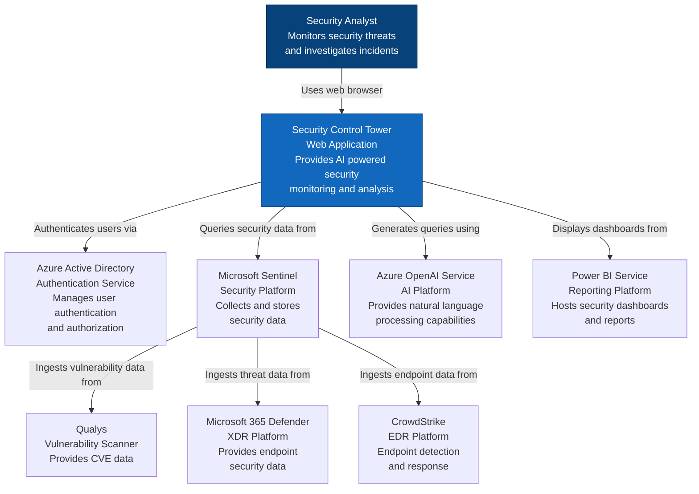

---

## Level 2: Container Diagram

This diagram shows the high-level technology choices and how containers communicate.

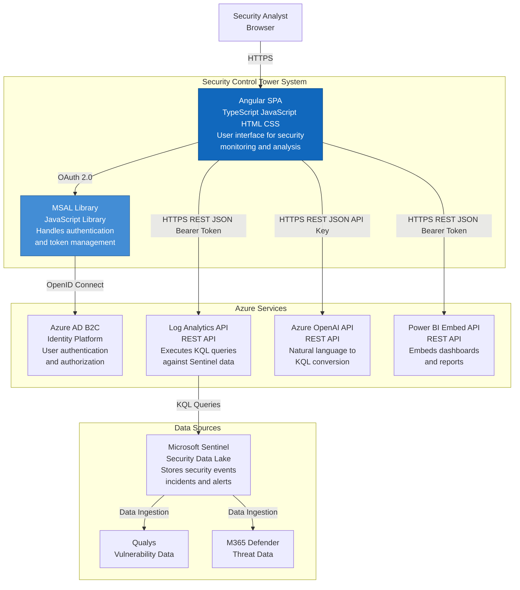

---

## Level 3: Component Diagram

This diagram shows the internal components of the Angular SPA container.

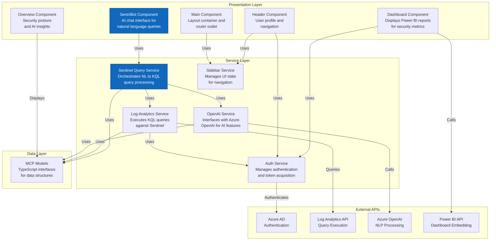

---

## Sequence Diagrams

### User Authentication Flow

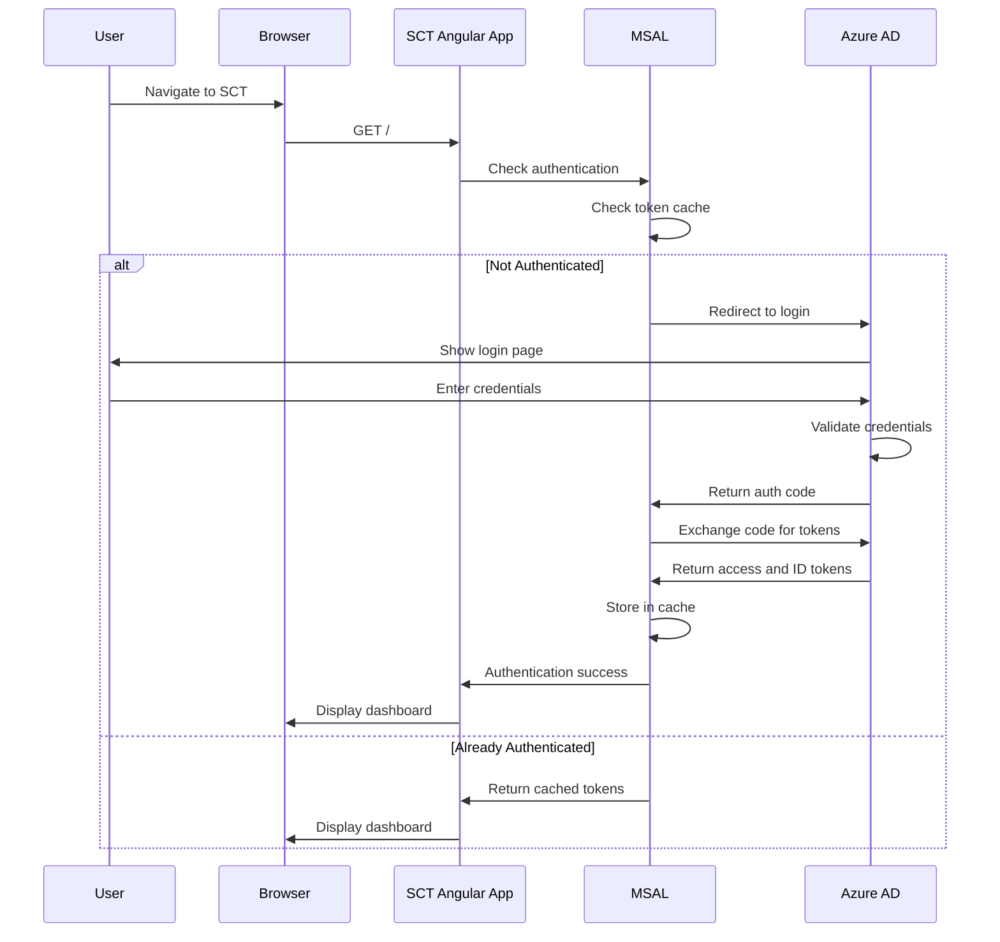

### SentriBot Query Processing Flow

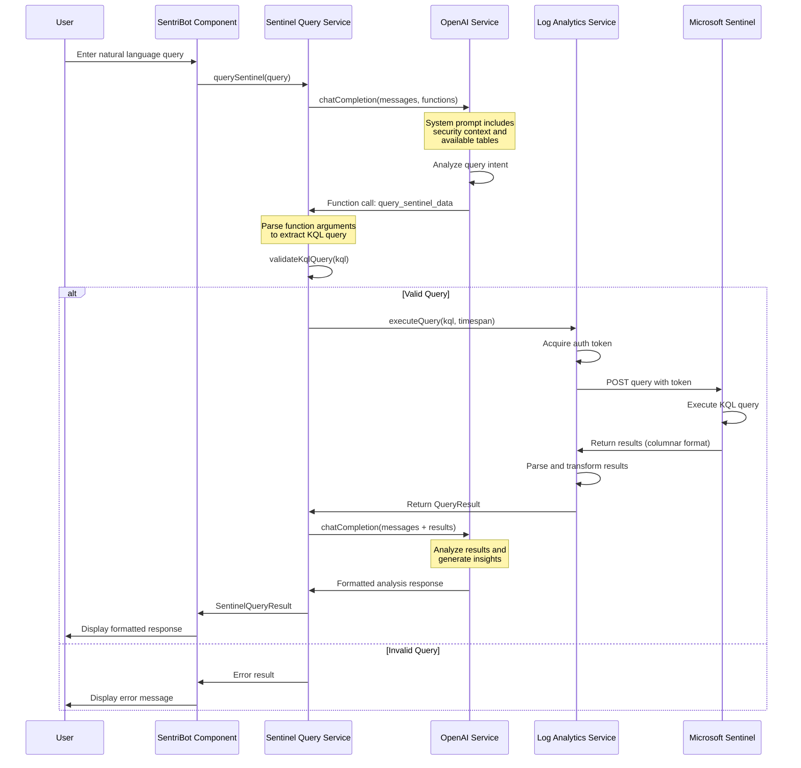

### Token Acquisition Flow

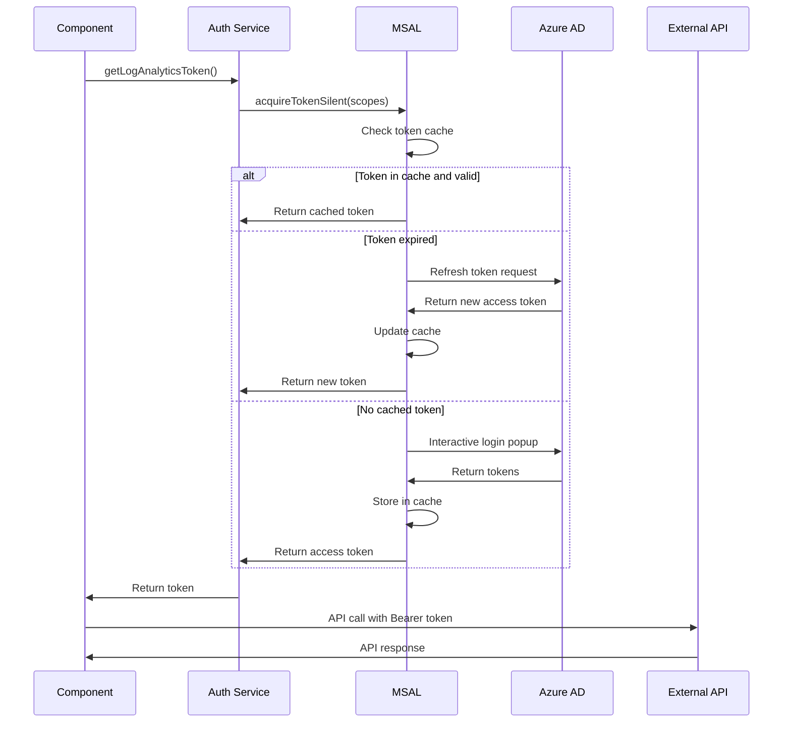

### Power BI Dashboard Embedding Flow

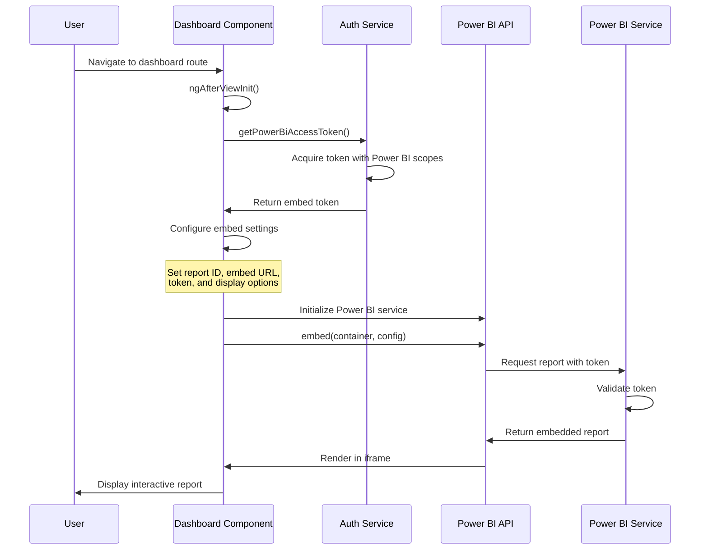

---

## Flow Diagrams

### User Risk Analysis Flow

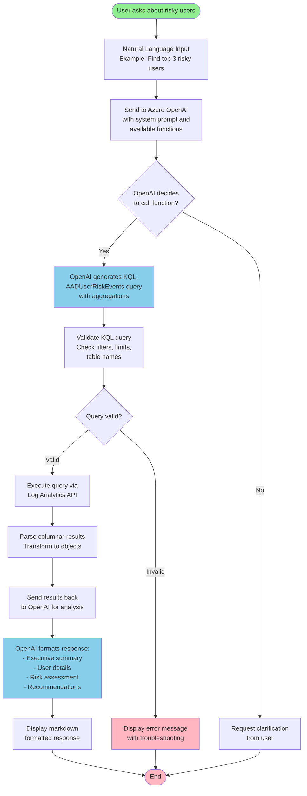

### Multi-Source Incident Correlation Flow

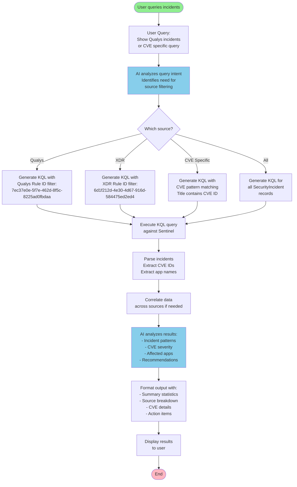

### Application Initialization Flow

```mermaid
flowchart TD
    Start([Application Start])
    
    LoadApp[Browser loads<br/>Angular application]
    
    Bootstrap[Bootstrap AppModule<br/>Initialize MSAL]
    
    CreateMSAL[Create MSAL instance<br/>with configuration]
    
    SetupInterceptors[Setup HTTP interceptors<br/>for automatic token injection]
    
    InitRouting[Initialize routing<br/>with MsalGuard]
    
    CheckAuth{User<br/>authenticated?}
    
    LoadCachedToken[Load cached token<br/>from localStorage]
    
    ValidateToken{Token<br/>valid?}
    
    RedirectLogin[Redirect to<br/>Azure AD login]
    
    UserLogin[User enters<br/>credentials]
    
    ReceiveToken[Receive and cache<br/>access tokens]
    
    NavigateApp[Navigate to<br/>default route]
    
    LoadComponents[Load route components<br/>Dashboard, SentriBot, etc]
    
    InitServices[Initialize services<br/>with dependencies]
    
    Ready[Application ready<br/>for user interaction]
    
    End([End])
    
    Start --> LoadApp
    LoadApp --> Bootstrap
    Bootstrap --> CreateMSAL
    CreateMSAL --> SetupInterceptors
    SetupInterceptors --> InitRouting
    InitRouting --> CheckAuth
    
    CheckAuth -->|Yes| LoadCachedToken
    CheckAuth -->|No| RedirectLogin
    
    LoadCachedToken --> ValidateToken
    
    ValidateToken -->|Valid| NavigateApp
    ValidateToken -->|Expired| RedirectLogin
    
    RedirectLogin --> UserLogin
    UserLogin --> ReceiveToken
    ReceiveToken --> NavigateApp
    
    NavigateApp --> LoadComponents
    LoadComponents --> InitServices
    InitServices --> Ready
    Ready --> End
    
    style Start fill:#90EE90
    style End fill:#90EE90
    style Ready fill:#90EE90
    style RedirectLogin fill:#FFD700
```

### Error Handling Flow

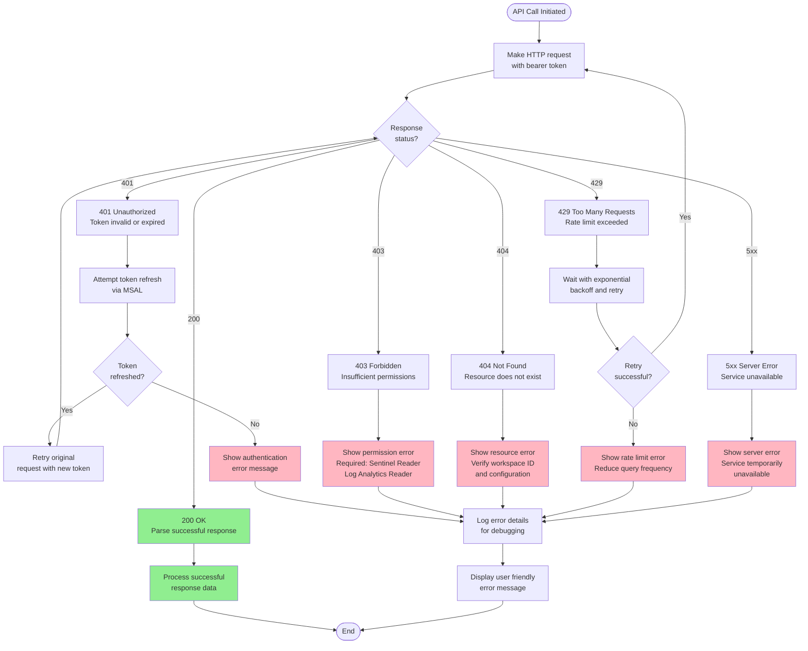

---

## Class Diagram

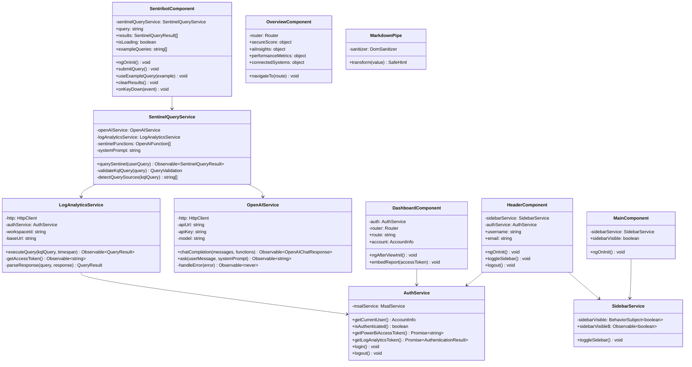

---

## Deployment Diagram

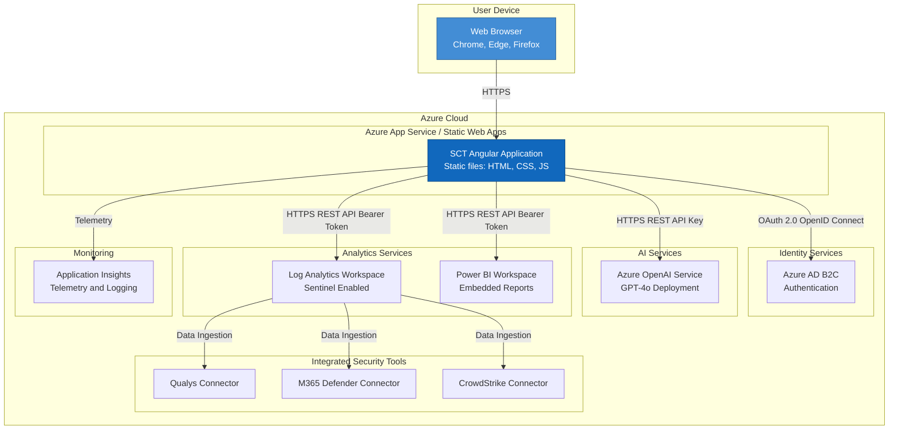

---

**Document Version**: 1.0  
**Last Updated**: 2024  
**Format**: Mermaid Diagrams  
**Purpose**: Visual architecture documentation for Security Control Tower
